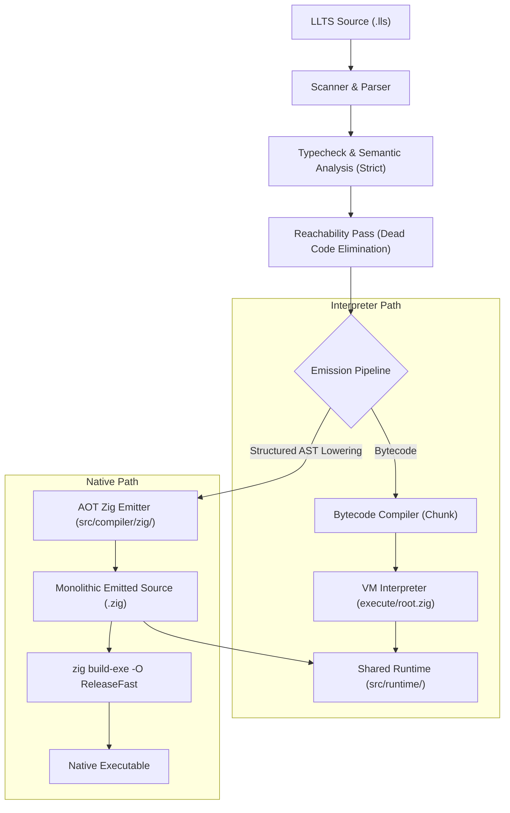

# Implementation Plan: Runtime-Driven Native Backend for LLTS

## Goal Description

Implement a native compilation target for LLTS by emitting **runtime-driven Zig code** that compiles via `zig build-exe` to produce standalone native binaries.

Unlike a high-level source-to-source transpiler (which delegates semantics, object lifetimes, and type rules to the Zig language compiler), this backend lowers LLTS code into **compiled runtime operations** that execute against a dedicated, shared **LLTS Runtime (`src/runtime/`)**. 

This approach achieves:
1. **Semantic Fidelity**: LLTS—not Zig—owns user code semantics. Memory watermarks, frame rewinding, packed heap layout in `bytes`, error returns, and numeric behavior behave identically in the native executable and the bytecode VM.
2. **Interpreter Dispatch Elimination**: Bytecode fetch, decode, and dynamic indirect jumps are replaced with native function calls, local variables, and static branch instructions.
3. **Zero External Dependencies**: Uses the existing host `zig` compiler without requiring LLVM C-API bindings or external C toolchains.
4. **LLVM Optimizations for Free**: Compiling the emitted runtime code with `zig build-exe -O ReleaseFast` allows LLVM to inline runtime primitives and optimize hot paths without LLTS needing to maintain an LLVM backend.

---

## Architectural Decisions & Soundness Guarantees

> [!IMPORTANT]
> **Core Architectural Principles**
> 1. **Strict by Default**: Native compilation assumes strict type soundness by default (`--strict` is preserved as a transitional gate for the VM/typechecker).
> 2. **CLI Commands**: We support both `llts emit-zig <file.lls> -o <out.zig>` (for inspecting generated runtime code) and `llts build <file.lls> --native -o <bin>` (for producing native executables).
> 3. **Dedicated `runtime/` Folder**: The runtime substrate is factored into `src/runtime/` (or root `runtime/`), cleanly separating reusable runtime primitives (heap, frames, memory, values, builtins) from the VM's bytecode interpreter loop.
> 4. **Runtime Code Emission (Not High-Level Zig)**: The emitter translates LLTS AST / ops into calls to the LLTS runtime environment rather than attempting to emit high-level idiomatic Zig constructs.

### The 4 Soundness Pillars

To prevent performance degradation and architectural impedance mismatches, the native backend is grounded on four strict design guarantees:

#### 1. Unboxed Native Locals vs. The "Stack Trap"
- **Problem**: Naively translating bytecode ops into software operand stack calls (`ctx.push(ctx.opAdd(ctx.pop(), ctx.pop()))`) destroys performance. CPU register allocation is defeated, and excessive memory round-trips occur.
- **Guarantee**: Since LLTS is strict and statically typed, all local variables and function parameters are lowered to **unboxed native Zig variables** (`var a: i64`, `const b: u8`).
- Operations on these locals invoke inline runtime helpers (`rt.opAddI64(a, b)`, `rt.opAddTypedWrap(...)`), enforcing exact LLTS arithmetic and bounds semantics while allowing LLVM to place variables in CPU registers (`rax`, `rbx`) and vectorize loops.

#### 2. AST-Driven Structured Lowering (Post-Typecheck)
- **Problem**: Emitting from a flat bytecode `Chunk` forces the emitted Zig code into artificial basic blocks with `while/switch` or jump labels, obstructing LLVM branch optimization and vectorization.
- **Guarantee**: Emission runs after `analyze()`, `typecheck()`, and `reachability()`. The emitter walks the **analyzed, typed AST**, generating native structured control flow (`if/else`, `while`, `for`, `switch`) while calling runtime helpers for operations and memory access.

#### 3. RAII Frame Watermark Invariant via `defer`
- **Problem**: LLTS relies on frame watermarks (`heap_watermark` and `bytes_watermark`) to automatically rewind frame-allocated aggregates on function exit, with compile-time escape prevention.
- **Guarantee**: Every emitted function wraps its body with Zig's zero-cost native `defer`:
  ```zig
  pub fn lls_func_example(ctx: *rt.Context, a: i64) !i64 {
      const frame_mark = ctx.enterFrame();
      defer ctx.leaveFrame(frame_mark); // Guaranteed rewind on return, early return, or error exit

      const box = rt.allocFrame(ctx, Box{ .val = a });
      return box.val;
  }
  ```
  This provides provable semantic equivalence to the VM's `doReturn` frame cleanup without requiring custom exception unwinding.

#### 4. Monolithic Whole-Program Emission
- **Problem**: Emitting separate Zig files for each LLTS module introduces complicated cross-module build dependencies and inhibits compiler optimizations.
- **Guarantee**: The emitter processes all reachable modules identified by `reachability.zig` and emits a **single, unified `.zig` compilation unit**. This gives `zig build-exe -O ReleaseFast` full visibility for Whole-Program Optimization (WPO), dead-code stripping, and aggressive interprocedural inlining.

---

## Technical Architecture



---

### Component: Runtime Architecture (`src/runtime/`)

Extract and structure the runtime engine into a dedicated folder so both the VM interpreter and emitted native Zig code execute identical logic.

#### `src/runtime/root.zig`
Top-level export for all runtime capabilities:
```zig
const std = @import("std");

pub const Context = @import("context.zig").Context;
pub const Value = @import("value.zig").Value;
pub const Heap = @import("heap.zig").Heap;
pub const Memory = @import("memory.zig");
pub const Ops = @import("ops.zig");
pub const Builtins = @import("builtins.zig");
```

#### `src/runtime/context.zig`
Execution context managing the call stack, packed byte heap, frame watermarks, and globals:
- Frame bump and watermark rewinding (`allocFrameBytes`, `rewindPacked`).
- Immortal heap region floor.
- Global slots and call frames.

#### `src/runtime/ops.zig`
Concrete runtime functions corresponding to LLTS bytecode operations:
- Arithmetic: `opAdd(ctx, a, b)`, `opAddTyped(ctx, a, b, width)`, `opAddWrap(...)`.
- Comparisons: `opEqual(ctx, a, b)`, `opLess(...)`.
- Heap & Slices: `opLoadField(ctx, obj, offset, kind)`, `opStoreField(...)`, `opSlice(ctx, obj, lo, hi)`.
- Memory & Arenas: `opArenaCreate(hint)`, `opArenaAlloc(...)`, `opArenaReset(...)`, `opArenaDeinit(...)`.
- Errors: `opMakeError(ctx, msg)`, `opIsError(val)`.

---

### Component: Native Zig Codegen (`src/compiler/zig/`)

Lowers analyzed LLTS AST into runtime-driving Zig functions.

#### `src/compiler/zig/root.zig`
Entry point for the native emitter:
```zig
const std = @import("std");
const ast = @import("../../ast/root.zig");
const state_mod = @import("../state.zig");
const emitter = @import("emitter.zig");

pub const EmitOptions = struct {
    release: bool = false,
    runtime_path: []const u8 = "src/runtime/root.zig",
};

pub fn emitRuntimeZig(
    allocator: std.mem.Allocator,
    doc: *const ast.Document,
    state: *const state_mod.CompilerState,
    writer: anytype,
    options: EmitOptions,
) !void {
    var emit_ctx = try emitter.Emitter.init(allocator, doc, state, writer, options);
    defer emit_ctx.deinit();
    try emit_ctx.emit();
}
```

#### `src/compiler/zig/emitter.zig`
Translates functions and statements into Zig code that calls `src/runtime/`:
- **Imports & Setup**: Emits `@import("runtime")` and initializes `RuntimeContext`.
- **Functions**: Each LLTS `@func` becomes a Zig function `fn lls_func_*(ctx: *rt.Context, ...) !RetType`.
- **Unboxed Variables**: Parameters and local bindings emit as typed native variables (`var x: i64 = ...`).
- **Watermark RAII**: Wraps every function body with `const mark = ctx.enterFrame(); defer ctx.leaveFrame(mark);`.
- **Top-Level Code**: Emits `lls_main(ctx)` initializing globals and running top-level statements.
- **Entry Wrapper**: Emits standard Zig `pub fn main() !void` initializing the allocator, running `lls_main`, and handling process exit.
- **Control Flow**: Lowered into native `if/else`, `while/for` loops, labels, and `break`/`continue`—preserving exact branch conditions via `rt.isTruthy(...)`.

---

### Component: CLI & Pipeline (`src/cli/` & `src/pipeline.zig`)

#### `src/cli/root.zig`
1. Add `emit-zig` command:
   ```bash
   llts emit-zig <file.lls> -o <out.zig>
   ```
2. Update `build` command with `--native` / `-n`:
   ```bash
   llts build <file.lls> --native -o <output_binary>
   ```

#### `src/pipeline.zig`
1. Implement `emitZigCode(allocator, path, source, out_path, options)`.
2. Implement `compileNativeBinary(allocator, path, source, out_binary_path, options)`:
   - Emits the runtime Zig code to a cached / temporary file.
   - Spawns `zig build-exe <temp.zig> -Mruntime=<path_to_runtime> -O ReleaseFast -femit-bin=<out_binary_path>`.

#### `src/compiler/llvm/root.zig`
Cleanly remove the inactive LLVM stub module.

---

## Phased Implementation Roadmap

1. **Phase 1: Runtime Decoupling (`src/runtime/`)**
   - Extract core types (`Value`, memory layout, packed byte heap, arena manager) into `src/runtime/`.
   - Implement `src/runtime/ops.zig` with standalone functions for basic arithmetic, locals, and memory.
   - Verify the VM continues to function cleanly using the unified runtime foundation.

2. **Phase 2: Emitter Core & `llts emit-zig`**
   - Implement `src/compiler/zig/emitter.zig` to generate runtime-driving Zig functions for basic programs (arithmetic, functions, returns, locals with unboxed variables).
   - Wire `llts emit-zig <file.lls> -o <out.zig>`.
   - Verify generated `.zig` files compile cleanly with `zig test` or `zig run`.

3. **Phase 3: Control Flow, Loops, and Heap Operations**
   - Implement structured lowering for `@if`, `@for`, `@switch`.
   - Lower packed struct loads/stores (`opLoadField`, `opStoreField`) and slices (`opSlice`).
   - Lower `defer`, `errdefer`, and error propagation (`?`, `error(...)`).
   - Enforce RAII frame watermark cleanup in all emitted functions.

4. **Phase 4: Full Native Compilation (`llts build --native`)**
   - Implement subprocess invocation of `zig build-exe` in `src/pipeline.zig`.
   - Support `-O ReleaseFast` and `-O Debug`.
   - Verify with existing examples (`examples/hello-world.lls`, `examples/functions.lls`, `examples/test-std.lls`).

5. **Phase 5: Conformance Testing & Parity**
   - Run the Bun test suite across both the bytecode VM runner and the native binary runner to ensure 100% output and error parity.

---

## Verification Plan

### Automated Tests
1. **Runtime Operation Tests**:
   - `zig test src/runtime/tests.zig`: Test that runtime ops perform checked arithmetic, byte packing, and frame rewinds correctly.
2. **Emitter Golden Tests**:
   - Emit runtime Zig for test fixtures and compile them using `zig test`.
3. **End-to-End Parity Tests**:
   - Execute both bytecode and native binary on identical `.lls` inputs and compare:
     - Standard output
     - Standard error
     - Exit codes
   ```bash
   ./zig-out/bin/llts run examples/hello-world.lls > /tmp/vm.out
   ./zig-out/bin/llts build examples/hello-world.lls --native -o /tmp/hello_native
   /tmp/hello_native > /tmp/native.out
   diff /tmp/vm.out /tmp/native.out
   ```
4. **Bun Test Suite**:
   - Run the full test suite with `--native` configuration:
     ```bash
     bun test tests/
     ```

### Manual Verification
- Compile and run `examples/hello-world.lls`:
  ```bash
  ./zig-out/bin/llts emit-zig examples/hello-world.lls -o /tmp/hello.zig
  cat /tmp/hello.zig # Inspect readable runtime calls
  ./zig-out/bin/llts build examples/hello-world.lls --native -o ./hello_bin
  ./hello_bin
  ```
