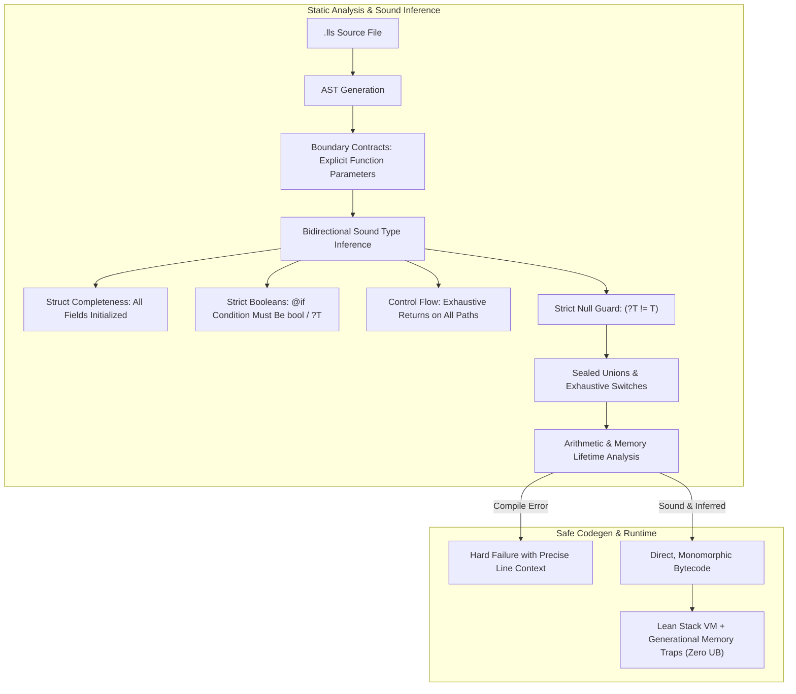

# LLTS Total Soundness & Sound Inference Roadmap: "If It Compiles, It Works"

> **Goal:** Eliminate runtime surprises, undefined behavior, missing property crashes ("a does not exist on b"), null pointer dereferences, use-after-free corruption, and control-flow traps by transforming LLTS from a gradual language into a **sound, static, correct-by-construction systems language powered by sound bidirectional inference**.

---

## 1. Vision & The Ten Soundness Invariants

The goal is to provide **total compile-time safety and ergonomic type inference** without sacrificing LLTS's low-level systems characteristics (arenas, packed structs, explicit memory, and no tracing GC).

```
┌────────────────────────────────────────────────────────────────────────┐
│                        LLTS Soundness Invariants                       │
├────────────────────────────────┬───────────────────────────────────────┤
│ 1. No Null Pointer Errors      │ Accessing '?T' without unwrapping is  │
│                                │ a compile-time rejection.             │
├────────────────────────────────┼───────────────────────────────────────┤
│ 2. No "Property Does Not Exist"│ Member access on unions or objects    │
│                                │ requires static proof of existence.   │
├────────────────────────────────┼───────────────────────────────────────┤
│ 3. No Uninitialized Memory     │ Struct initialization must provide    │
│                                │ all declared non-optional fields.     │
├────────────────────────────────┼───────────────────────────────────────┤
│ 4. No Truthiness Surprises     │ Conditions in '@if' must be 'bool' or │
│                                │ optional captures. Zero JS coercion.  │
├────────────────────────────────┼───────────────────────────────────────┤
│ 5. Sound Local Inference       │ 100% sound bottom-up & top-down       │
│                                │ inference. No guessing, no 'unknown'. │
├────────────────────────────────┼───────────────────────────────────────┤
│ 6. Clear Boundary Contracts    │ Function parameters must be typed.    │
│                                │ Bodies infer locals and return types. │
├────────────────────────────────┼───────────────────────────────────────┤
│ 7. Exhaustive Pattern Matching │ Missing an enum variant or union arm  │
│                                │ in '@switch' is a compile-time error. │
├────────────────────────────────┼───────────────────────────────────────┤
│ 8. Exhaustive Return Paths     │ Falling off the end of a typed        │
│                                │ function is rejected at compile time. │
├────────────────────────────────┼───────────────────────────────────────┤
│ 9. Zero Use-After-Free / UB    │ Lexical arena lifetimes + generational│
│                                │ handle traps prevent dangling memory. │
├────────────────────────────────┼───────────────────────────────────────┤
│ 10. Arithmetic Fault Safety    │ Compile-time checks for '/ 0'; defined│
│                                │ overflow across all integer widths.   │
└────────────────────────────────┴───────────────────────────────────────┘
```



---

## 2. Comprehensive Gap Analysis (Audit of Current Compiler)

An audit of the compiler reveals nine specific areas where dynamic fallbacks currently allow invalid programs to compile:

| # | Vulnerability | Location in Codebase | Consequence at Runtime |
|---|---|---|---|
| **1** | **Gradual `TUnknown` Short-Circuit** | [`src/compiler/typecheck/root.zig#L94`](file:///home/apex/Workspace/llts-zig/src/compiler/typecheck/root.zig#L94) | `requireAssignAt` returns `ok` if either side is `unknown`. Untyped variables act like `any` and bypass validation. |
| **2** | **Optional Auto-Peeling** | [`src/compiler/typecheck/ir.zig#L534`](file:///home/apex/Workspace/llts-zig/src/compiler/typecheck/ir.zig#L534), [`#L542`](file:///home/apex/Workspace/llts-zig/src/compiler/typecheck/ir.zig#L542) | `structNameOf` and `shapeFieldsOf` peel `optionalPayload(t)`. Accessing `opt.field` compiles even when `opt` can be `null`. |
| **3** | **Uninitialized Struct Fields** | [`src/compiler/typecheck/root.zig#L1422-L1435`](file:///home/apex/Workspace/llts-zig/src/compiler/typecheck/root.zig#L1422-L1435) | `inferStructInit` checks provided fields but never verifies if required fields were omitted. `User{}` compiles with uninitialized/zero bytes. |
| **4** | **JS-Style Truthiness Coercion** | [`src/bytecode/value.zig#L124`](file:///home/apex/Workspace/llts-zig/src/bytecode/value.zig#L124), [`root.zig#L1049`](file:///home/apex/Workspace/llts-zig/src/compiler/typecheck/root.zig#L1049) | `@if (cond)` allows ints, strings, and arrays (`[]` is falsy!). Conditions are not typechecked against `bool` (`u1`). |
| **5** | **Union Member Fallback** | [`src/compiler/typecheck/root.zig#L897-L909`](file:///home/apex/Workspace/llts-zig/src/compiler/typecheck/root.zig#L897-L909) | Accessing missing fields on error unions or untagged unions returns `TUnknown` instead of triggering a compile error. |
| **6** | **Unannotated Function Signatures** | [`src/compiler/typecheck/from_ast.zig#L47`](file:///home/apex/Workspace/llts-zig/src/compiler/typecheck/from_ast.zig#L47) | Missing parameter and return type annotations default to `TUnknown`, allowing arbitrary inputs and invalid return types. |
| **7** | **Missing Return Path Traps** | [`src/compiler/typecheck/root.zig#L1704`](file:///home/apex/Workspace/llts-zig/src/compiler/typecheck/root.zig#L1704) | Functions without return on all branches fall off the end, returning uninitialized stack slots. |
| **8** | **Use-After-Free Across Arenas** | [`src/compiler/escape.zig`](file:///home/apex/Workspace/llts-zig/src/compiler/escape.zig), [`src/vm/`](file:///home/apex/Workspace/llts-zig/src/vm/) | Pointers (`*T`) can outlive their owning `Arena`. Dereferencing post-`arena.deinit()` causes silent memory corruption. |
| **9** | **Dynamic Array Indexing & Division Traps** | [`src/compiler/typecheck/root.zig#L911`](file:///home/apex/Workspace/llts-zig/src/compiler/typecheck/root.zig#L911), [`src/vm/execute/arith.zig#L43`](file:///home/apex/Workspace/llts-zig/src/vm/execute/arith.zig#L43) | Out-of-bounds `arr[i]` and division by zero `/ 0` are only caught at runtime as VM aborts. |

---

## 3. Phased Implementation Roadmap

### Phase 1: Eradicate Gradual Holes & Implement Sound Inference

Replace heuristic `unknown` fallbacks with **sound bidirectional type inference** (synthesis bottom-up, checking top-down).

* [x] **1.1 Enforce Boundary Contracts on Declarations**
  * Function parameters must have explicit type annotations:
    ```lls
    # REJECTED AT COMPILE TIME:
    @func add(a, b) { return a + b; }

    # REQUIRED (Clear Contract):
    @func add(a: i64, b: i64) { return a + b; }
    ```
  * Struct fields must have explicit type annotations.
* [x] **1.2 Sound Local Variable Synthesis (`$x = expr`)**
  * Infer the concrete type strictly from `expr` (e.g. `$arena = Arena.init();` infers `Arena`).
  * **No Unsound Fallback**: If `expr` cannot be synthesized (e.g., bare unannotated `$x;` or empty array `$items = []`), halt compilation:
    `error: cannot infer type for local '$items' from empty array literal; explicit type annotation required.`
* [x] **1.3 Contextual Literal Inference (Top-Down Checking)**
  * Propagate expected types down to literal values:
    * In `$mask: u8 = 0b0000_1111;`, infer `u8` and verify statically it fits in `0..255`.
    * Reject overflow at compile time: `$b: u8 = 300;` → `error: literal 300 overflows target type 'u8'`.
* [x] **1.4 Sound Return-Type Deduction & Exhaustive Return Analysis**
  * When `: ReturnType` is omitted, inspect **all** control flow paths.
  * Verify all branches return mutually compatible types, joining into a single concrete type or sealed union.
  * **Control Flow Check**: If any execution path can fall through without returning, fail compilation:
    `error: function 'find_id' must return a value on all control paths.`
* [x] **1.5 Reclassify `unknown` as an Opaque Sealed Type**
  * `unknown` ceases to act as an `any` pass-through.
  * In [`src/compiler/typecheck/root.zig`](file:///home/apex/Workspace/llts-zig/src/compiler/typecheck/root.zig), remove `if (ir.involvesUnknown(got) or ir.involvesUnknown(expected)) return;`.
  * Operations on `unknown` require explicit narrowing or `@as(T, val)`.

---

### Phase 2: Total Null Safety & Struct Completeness

Ensure that null pointer dereferences and uninitialized memory are syntactically impossible.

* [x] **2.1 Disallow Member Access on Optional Types**
  * Remove `optionalPayload` auto-peeling from [`src/compiler/typecheck/ir.zig#L534`](file:///home/apex/Workspace/llts-zig/src/compiler/typecheck/ir.zig#L534) and [`#L542`](file:///home/apex/Workspace/llts-zig/src/compiler/typecheck/ir.zig#L542).
  * In member access checking, if the base expression has type `?T` or `?*T`, reject compilation:
    ```
    error: cannot access field 'name' on optional type '?User'
    note: unwrap with '@if (user) |u| ...' or 'user.?'
    ```
* [x] **2.2 Mandatory Struct Completeness (No Uninitialized Fields)**
  * Update [`inferStructInit`](file:///home/apex/Workspace/llts-zig/src/compiler/typecheck/root.zig#L1404):
    * Iterate through all fields declared on the target struct.
    * Every field that lacks a default value and is not optional (`?T`) **must be provided** in the initializer:
      ```lls
      # COMPILE ERROR: missing required field 'name' in initialization of 'User'
      $u = User{ id: 1 };
      ```
* [x] **2.3 Strict Container Unwrapping (`@if (expr) |v|`)**
  * LLTS strictly separates **Boolean Branching** (`@if (cond)`) from **Container Unwrapping** (`@if (expr) |v|`), following the model used by Zig and Rust:
    * **Optional `?T`**: tests `expr != null`, binds non-null `v: T`.
    * **Error union `T | error`**: tests `!@isError(expr)`, binds success payload `v: T`.
    * **Error capture in `@else`**: `@if (res) |ok| { ... } @else |err| { ... }` allows capturing error payloads on the failure path.
  * **Rejection of Non-Container Captures**: Capturing on plain types (`i64`, `[]byte`, `User`) is a hard compile-time error. In gradual or dynamic languages, capturing on integers (e.g. `if (count)`) leads to bugs where `0` is a valid value but gets mistakenly treated as null or missing. In LLTS, `0` is a number, not a null state:
    ```lls
    $val: i64 = 42;
    @if (val) |v| { ... } # COMPILE ERROR: cannot capture from non-optional type 'i64'
                          # hint: check condition explicitly with '@if (val != 0)'
    ```
    *(Replaces the legacy permissive test in `tests/38_optional_unwrap.test.ts:130`)*.
  * **Null-coalescing operator (`??`)**:
    ```lls
    $display_name = opt_user?.name ?? "Guest"; # Soundly non-optional
    ```
  * **Explicit assertion unwrap (`.?`)**:
    ```lls
    $must_user: User = opt_user.?; # Explicit, self-documenting panic if null
    ```
* [ ] **2.4 Distinct Non-Null Pointer (`*T`) vs Optional Pointer (`?*T`)**
  * Enforce that `*T` can **never** hold null. Passing `null` to `*T` fails at compile time.

---

### Phase 3: Strict Control Flow, Sealed Unions & Exhaustive Matching

Prevent truthiness bugs and "property `x` does not exist on `y`" runtime errors.

* [x] **3.1 Strict Boolean Condition Invariant (Eliminating Truthiness Coercion)**
  * When `@if (cond)` does **not** have a capture pipe `|v|`, `cond` **must** evaluate strictly to `u1` (`bool`).
  * Reject implicit truthiness coercion on numbers, strings, and collections:
    ```lls
    # REJECTED AT COMPILE TIME:
    @if (items_count) { ... }  # error: condition must be 'bool', got 'i64'
    @if (str) { ... }          # error: condition must be 'bool', got '[]byte'

    # REQUIRED:
    @if (items_count > 0) { ... }
    @if (str.len > 0) { ... }
    ```
  * Same invariant applies to `@for (cond)` loop conditions.
* [x] **3.2 Common Property Rule for Unions**
  * Accessing `obj.prop` on a union `A | B` is allowed only if both `A` and `B` define `prop` with compatible types.
  * Partial field access without prior narrowing is a hard compile error.
* [x] **3.3 Sound Union Arm Narrowing**
  * Inside `@switch (u.kind)` branches, soundly narrow `u` to the specific variant arm without requiring manual `@as` casts.
* [x] **3.4 100% Exhaustive `@switch` Verification**
  * Require all variants of `@enum`, `@error`, and tagged unions to be covered, or caught by `@else`.
* [x] **3.5 Error Union Guarding (`T | error`)**
  * Forbid member access on `T | error` directly; require handling via `?` (try-propagate), `@isError` narrowing, or `@catch`.

---

### Phase 4: Zero Undefined Behavior, Arithmetic & Lifetime Safety

Guarantee predictable execution and memory safety at the hardware and VM boundary.

* [ ] **4.1 Memory Safety: Lexical Arena Lifetimes & Generational Traps**
  * [x] **Compile-Time Lexical Arena Lifetimes**: Prevent pointers allocated via `@new(arena, ...)` from escaping outside the lexical scope of the owning `arena`.
    * `@new` inherits the lifetime of its allocator. An allocator that is a **body-local** of the current function (`$a = mem.create(0)` then `@new(a, …)`) makes the result frame-bound; returning that pointer is rejected:
      ```lls
      @func make(): *Box {
          $a = mem.create(0);
          return @new(a, Box { n: 1 }); # COMPILE ERROR: value escapes its arena region
      }
      ```
    * Allocators that outlive the call stay valid: an **arena parameter** (`make(a: mem.Arena)`) or a **module-level** arena (`$heap = mem.create(0)`) may be returned from. See `AllocRegion.arena_local` in [`src/compiler/state.zig`](file:///home/apex/Workspace/llts-zig/src/compiler/state.zig) and `allocatorIsFunctionLocal` in [`src/compiler/escape.zig`](file:///home/apex/Workspace/llts-zig/src/compiler/escape.zig).
  * [ ] **Runtime Zero-UB Trap**: Encode an `arena_id` and allocation generation into packed heap handles in `vm.bytes`.
    * If a pointer is accessed after its arena is deinitialized or reset, the VM traps **deterministically with an informative panic and stack trace**, completely eliminating silent memory corruption.
    * _Not yet implemented: use-after-`deinit()` currently reads stale bytes rather than trapping._
* [ ] **4.2 Compile-Time Arithmetic Fault Prevention**
  * Constant-evaluation pass checks all division and modulo operators (`/`, `%`):
    ```lls
    $bad = 42 / 0; # COMPILE ERROR: division by zero in constant expression
    ```
* [ ] **4.3 Explicit Integer Overflow Semantics**
  * Standardize numeric overflow behavior across debug and release builds:
    * Explicit wrapping semantics (`+%`, `-%`, `*%`).
    * Checked arithmetic for standard `+`, `-`, `*` with well-defined fatal diagnostic panics.
* [ ] **4.4 Safe Array & Slice Indexing**
  * **Compile-Time Bounds**: For `[N]T` fixed arrays where the index is constant, verify `0 <= i < N` at compile time.
  * **Safe Indexing API**: Introduce `arr.get(i): ?T` returning `null` if out of bounds.
  * **Bounds-Checked Traps**: Retain runtime bounds checks on dynamic `arr[i]`, ensuring trapped failure with line/column context rather than memory corruption.
* [ ] **4.5 Frame-Local Memory Invariant**
  * Reinforce the boundary in [`src/compiler/escape.zig`](file:///home/apex/Workspace/llts-zig/src/compiler/escape.zig): frame-allocated instances (`Foo{}`) can never escape the stack frame.

---

### Phase 5: Verification Suite & Compiler Diagnostics

Ensure no regressions can compromise the soundness invariants.

* [ ] **5.1 Comprehensive Negative Conformance Test Suite (`tests/compile_fails/`)**
  * Build a test runner that executes and asserts compile-time rejections:
    * `unannotated_param.lls` → rejects missing parameter type.
    * `missing_struct_field.lls` → rejects uninitialized non-optional fields.
    * `truthiness_coercion.lls` → rejects `@if (int_var)`.
    * `missing_return_path.lls` → rejects fall-through non-void functions.
    * `optional_field_access.lls` → rejects `opt.field`.
    * `partial_union_access.lls` → rejects un-narrowed union access.
    * `non_exhaustive_switch.lls` → rejects incomplete `@switch`.
    * `div_by_zero_const.lls` → rejects constant `/ 0`.
    * `null_to_pointer.lls` → rejects assigning `null` to `*T`.
* [ ] **5.2 Diagnostic Fix Hints**
  * Every soundness error must provide an actionable suggestion:
    * *"Missing field 'email' in initialization of 'User'."*
    * *"Condition must be a boolean ('u1') or optional capture. Did you mean 'x != 0'?"*
    * *"Missing return on path ending at line 42."*
* [ ] **5.3 Release-Mode Verification**
  * Verify that `--release` retains static soundness: since the compiler proves validity at compile time, release builds can strip assertion overhead without risking undefined behavior.

---

## 4. Architectural Comparison: Before & After

```
BEFORE (Gradual, Permissive, Potential Traps):
  $u = User{};            # Compiles! Fields left uninitialized; memory corruption.
  @if (items_count) { ... } # Compiles! JS truthiness bug (0 is falsy, [] is falsy).
  $n = opt_user.name;     # Compiles! Crashes with null dereference at runtime.
  @func calc(x) {         # Compiles! x is unknown; errors slip to runtime.
      return x * 2;
  }
  @func f(b: bool): i64 { # Compiles! Falls off end without return if b is false.
      @if (b) return 1;
  }

AFTER (Sound Inference, Total Safety & Zero UB):
  $u = User{};            # COMPILE ERROR: missing required field 'name'
  $u = User{ id: 1, name: "Alice" }; # Valid!

  @if (items_count)       # COMPILE ERROR: condition must be 'bool', got 'i64'
  @if (items_count > 0)   # Valid!

  $n = opt_user.name;     # COMPILE ERROR: cannot access field 'name' on '?User'
  @if (opt_user) |u| {    # Valid! 'u' soundly proven non-null
      print(u.name);
  }

  @func calc(x: i64) {    # Valid! Parameter typed; return type soundly deduced as i64
      return x * 2;
  }

  @func f(b: bool): i64 { # COMPILE ERROR: function must return a value on all control paths
      @if (b) return 1;
      return 0;           # Valid!
  }
```

---

## 5. Suggested Execution Order

```
[Phase 1] Boundary contracts, sound local inference & exhaustive return paths
    │
    ▼
[Phase 2] Strict null safety (ban opt.field) & struct completeness (no uninit fields)
    │
    ▼
[Phase 3] Strict boolean conditions (ban JS truthiness) & sealed union narrowing
    │
    ▼
[Phase 4] Memory safety (generational arena traps) & compile-time arithmetic checks
    │
    ▼
[Phase 5] Negative conformance test harness ('tests/compile_fails/')
```
